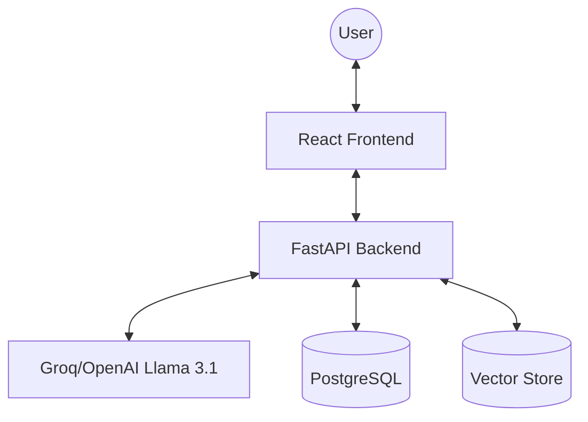

# 🧬 IntelliDocs AI

> **High-Fidelity Document Intelligence Engine**

IntelliDocs is a next-generation RAG (Retrieval-Augmented Generation) application designed for professional-grade document interaction. It breaks the "singular chat" mold by using a **3-Pane Dynamic Workspace** architecture (Sidebar, Chat, Artifact).

## 🏙️ System Architecture

## 📂 Project Structure

| Directory | Purpose | Detail |
|-----------|---------|--------|
| `/app` | Backend Core | FastAPI, RAG Pipeline, API Routes |
| `/Intellidocs AI - frontend` | Frontend UI | React, Tailwind, Framer Motion |
| `/knowledge` | Persistence | Stored document processing logs |

## 🚀 Key Features

*   **3-Pane Workspace**: Contextual separation between dialogue and visual artifacts.
*   **Intelligent RAG**: Real-time document parsing and context-aware synthesis.
*   **Neural Listeners**: Stream parsing for auto-triggering interactive UI components.
*   **Multi-Platform Design**: Fully optimized for Desktop, iPad, and Mobile.

---

## 🏗️ Technical Stack

*   **Backend**: Python 3.11+, FastAPI, Uvicorn, Pydantic.
*   **Frontend**: React 18, TypeScript, TailwindCSS, Lucide.
*   **Intelligence**: Groq AI (Llama 3.1 70B), Sentence Transformers.
*   **Animations**: Framer Motion 10.