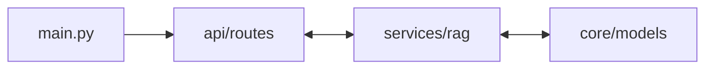

# 🧬 Backend Core - /app

The backend is built with **FastAPI**, prioritizing asynchronous performance and a clean, modular RAG pipeline.

---

## 🏙️ Backend Map

## 📂 Sub-Directory Overview

| Directory | Feature | Description |
|-----------|---------|-------------|
| `api/` | Routes | REST Endpoints, Document processing, Stream chat. |
| `core/` | Internal Logic | SQL Models, App Settings, Logging. |
| `services/` | Intelligence | The Heavy Lifting—RAG Pipeline, LLM Persona. |

### 📁 Key Files in `/app`

*   `main.py`: Entrypoint. Initializes FastAPI, CORS, and Routes.
*   `api/routes/chats.py`: The heart of the application—handles the LLM stream.
*   `services/rag/llm.py`: Persona management and Guardrails.
*   `services/rag/pipeline.py`: Vector search and context grounding.

---

## 🛠️ Requirements

*   `fastapi`, `uvicorn` (ASGI Server)
*   `groq`, `openai` (Intelligence)
*   `sentence-transformers` (Embeddings)
*   `SQLAlchemy`, `Alembic` (SQL DB)
