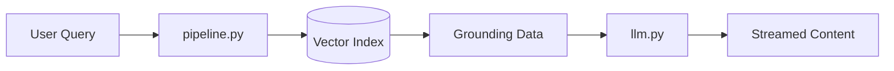

# 🧠 Intelligence Layer - /app/services/rag

This directory contains the logic responsible for **RAG (Retrieval-Augmented Generation)**, parsing, and context-grounding.

---

## 🏙️ RAG Pipeline Execution Flow

## 📂 File-Item Overview

| File | Sub-System | Summary |
|------|------------|---------|
| `pipeline.py` | Grounding | Vector search using SentenceTransformers. |
| `llm.py` | Synthesis | Persona prompt and conditional Artifact generation. |
| `parser.py` | OCR | Optional PDF text extraction logic. |

### 📁 Key Functions

*   `pipeline.ground_query(...)`: Links input string to document IDs.
*   `llm.generate_answer_stream(...)`: Streams token-by-token content with Artifact markers.
*   `parser.parse_pdf(...)`: Converts raw PDF into clean chunks.

---

## 🏗️ Technical Details

*   **Model**: Llama-3.1-70B (via Groq) / GPT-4 (via OpenAI)
*   **Embeddings**: `all-MiniLM-L6-v2`
*   **Logic**: Context-window optimization and Top-K retrieval.
